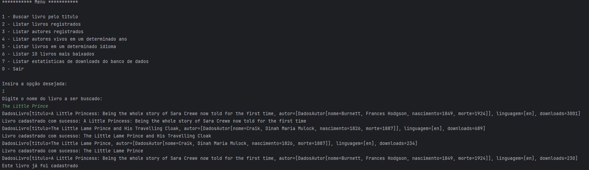
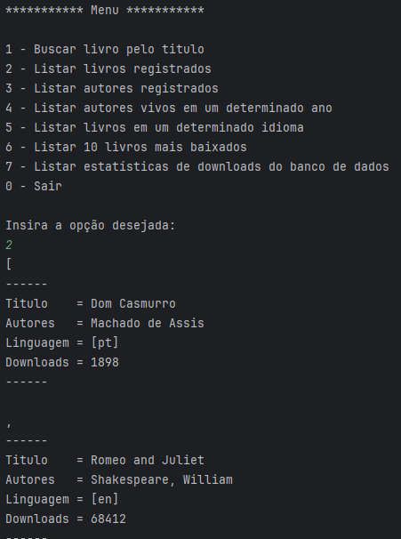
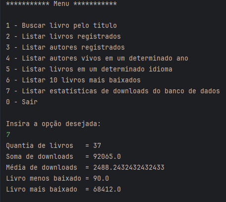

#  LiterAlura Oracle One 📚
* Desenvolvido em Java com a API de Livros e Autores Gutendex.
## Descrição 💎
* Esse projeto é capaz de obter dados da API e manipulá-los em um banco de dados, onde foi utilizado o Postgres.
## Funcionalidades 💎
* Cadastro de Livros e seus Autores automaticamente, também relacionando-os no banco de dados.
* Listagem de dados:
* * Listagem de livros registrados
* * Listagem de Autores registrados
* * Listagem de Autores vivos em um determinado ano
* * Listagem de livros em uma determinada linguagem
* * Listagem de top 10 livros mais baixados
* * Listagem de estatísticas de downloads de todos os livros registrados no banco de dados
* Validações e Restrições, garantido que não seja inserido dados duplicados, além de manter a integridade relacional.

# Exemplos 🚀
💎 Registrar Livro 💎 

💎 Listar Livros Registrados 💎

 

  💎 Listar Estatisticas 💎
 

# Ferramentas Utilizadas 🛠️
* Java
* Spring Boot
* Spring Data JPA
* PostgreSQL (Banco de Dados)
* Maven (Gerenciamento de Dependências)
* Jackson (Serialização e Desserialização JSON)

Autor: Leandro Malikoski 
Contato: leandroborgesmalikoski@gmail.com 
GitHub: https://github.com/leandromalikoski